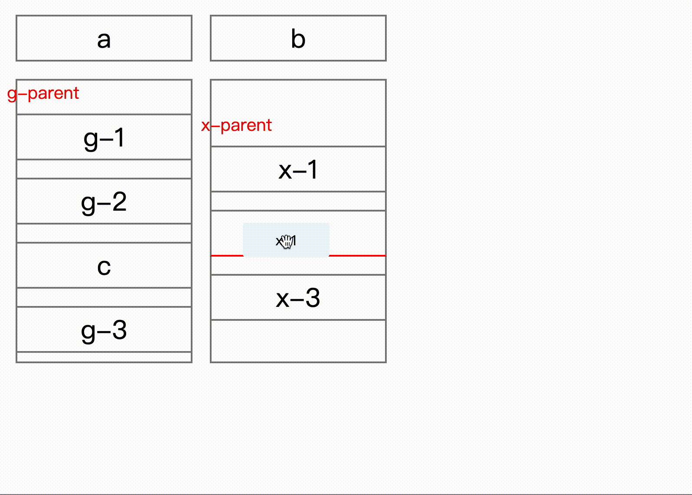
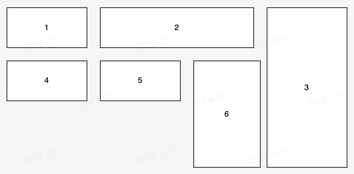

# react-flex-dnd

**React drag and drop sort support flex layout and nested.**



**This package using hooks, note that your React version is above 16.8 :)**

Why flex? flex covers most demands, like list vertically or horizontally, if your list can wrap, that's the problem what here to solve. Flex wrap is likely a grid layout, but there is difference.

**Flex wrap layout, just like using css property flex wrap.**


Grid layout, it uses all spaces to place elements.


**If your demand is grid layout, I suggest [react-grid-layout]**(https://github.com/react-grid-layout/react-grid-layout).

Play with react-flex-dnd: https://asweallcan.github.io/react-flex-dnd, the example is pretty simple, **only show one level nested, but it can be infinite nested if you want.**

## Useage

### DragDropProvider

Must wrap your app with it, it provides controllers for your draggables and droppables.

**rootId?: string**

If using React 17, it is required to identify app root el.

**ghostId?: string**

html id property for ghost element.

**onDragEnd**

```typescript
onDragEnd: (params: {
  to: { index: number; droppableId: string };
  from: { index: number; droppableId: string };
  draggableId: string;
}) => void;
```

Here comes key part, onDragEnd can get sort result after interaction, `from` shows old place for the dragging item, but for attention, the index in the `to` is the new index with dragging item removed. Normally when drag end, you remove element first then insert dragging item to the new place.