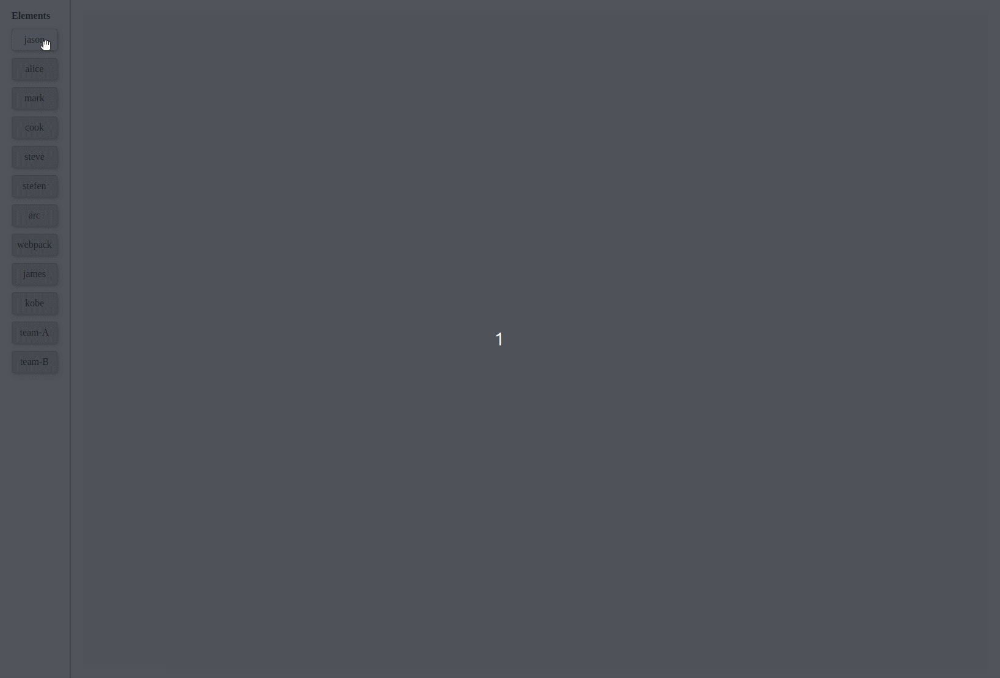
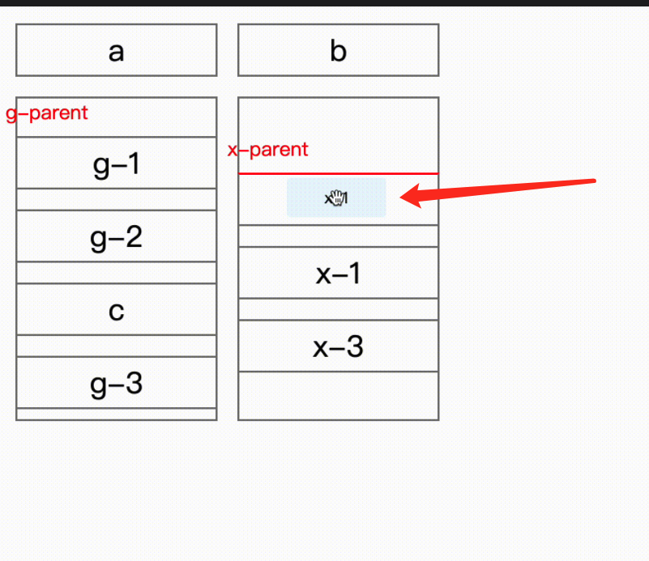

# react-flex-dnd

**React drag and drop sort support flex layout and nested.**

This package using hooks, note that your React version is above 16.8 :)

Also not support mobile, but it's not time consuming, I am doing this.



[Playground](https://asweallcan.github.io/react-flex-dnd), the demo currently is pretty simple, **only show one level nested, but it can be infinite nested if you want**, I will enrich it after a period of time.

## Core characteristics

- Support any layout except grid
- High customization
- Clean and powerful api which is simple to get started with
- Element styles are not affected
- Easy nested

**If your demand is grid layout, I suggest [react-grid-layout](https://github.com/react-grid-layout/react-grid-layout).**

## Currently supported features

- Vertical lists
- Horizontal lists
- Row flex wrap
- Column flex wrap
- Auto scrolling
- Nested droppables and draggables

## Simple Example

```tsx
<DragDropPrivider rootId="app" ghostId="myGhost" onDragEnd={(result) => {
  const {from, to, draggableId} = result;

  // update your data
}}>
  <Droppable id="custom-droppable">
    {droppableProps => <div {...droppableProps}>
      {elements.map(element => {
        const {key, content} = element;

        return <Draggable id={key} belongsTo="custom-droppable">
          {draggableProps => <div {...draggableProps}>{content}</div>}
        </Draggable>
      })}
    <div>}
  </Droppable>
  <Ghost>
    <div class="ghost">
      Dragging item
    </div>
  </Ghost>
</DragDropPrivider>
```

## Usage

### DragDropProvider

Must wrap your app with it, it provides controllers for your draggables and droppables.

**rootId?: string**

In React 17, it is required to identify React app root element.

**ghostId?: string**

Html id property for ghost element.

**onDragEnd**

```typescript
onDragEnd: (params: {
  to: { index: number; droppableId: string };
  from: { index: number; droppableId: string };
  draggableId: string;
}) => void;
```

Here comes key part, onDragEnd can get sort result after interaction, `from` shows old place for the dragging item, but for attention, the index in the `to` is the new index with dragging item removed. Normally when drag end, you remove element first then insert dragging item to the new place.

### Draggable

Wrap draggable element with it.

**belongsTo: string**

Identify your draggable element in which droppable.

**threshold?: number**

Default 1, it means how close when you drag an element to another element edge to sort. Especially when nested, your droppable wrapped with draggable, if you what drag an element into a draggable droppable, threshold must below 1.

```tsx
<Draggable id="custom-draggable" threshold={0.3}>
  {draggableProps => <Droppable {...draggbleProps} id="custom-droppable" draggableId="custom-draggable">
    {droppableProps => <div {...droppableProps}>
      {elements.map(element => {
        const {key, content} = element;

        return <Draggable id={key} belongsTo={`custom-draggable-${key}`}>
          {draggableProps => <div {...draggableProps}>{content}</div>}
        </Draggable>
      })}
    <div>}
  </Droppable>}
</Draggable>
```

**disabledEdges?: string[]**

Draggable elements have 4 edges: top, left, bottom and right, this props is to disable some edges.

### Droppable

Wrap a element that draggable can be dragged in.

**direction?: "vertical" | "horizontal"**

Default horizontal, hotizontal meas `flex-direction: row`.

**draggableId?: string**

When a element can be dragged in and dragged, it means this element is a draggable Droppable.

### Ghost

When drag a item, ghost indicates what you are dragging.



### DragDropContext

You can use useContext to convinently to get draggingId and droppableId instead of passing props from the top.